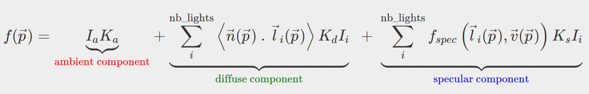

### *This project has been created as part of the 42 curriculum by dopereir and joao-vri*

# **Description:**

The miniRT project explores and guide the devolopers into the firsts steps
in computer graphics, and introduce to base concepts of the field such as
vector math, geometric intersections, object shading, lighting models and
much more we gonna see through this document.

### 1. Goals:
- The project main goal is to create a simple RayTracing Engine that render a static scene applying a baseline of concepts, the ability to manipulate the object presence in the scene, light management features *e.g:* spot brightness, hard shadows, ambient lighting and diffuse lighting.
- A few requiriments are defined, a limited scope of standard C library functions *(check notes)*, at least 3 types of geometric objects *(Spheres, cylinders and planes)*, and the usage of MiniLibX, the 42 school framework for graphics.

# **Instructions:**

### 1. Install MiniLibX dependencies (Linux)

`sudo apt-get update`

`sudo apt-get install -y xorg libxext-dev libx11-dev libxrender-dev libxrandr-dev libbsd-dev`

| Library		|	What is for |
| -------------- | ------------- |
| xorg | Graphic base server for Linux |
| libxext-dev | X11 module extensions used by MiniLibX |
| libx11-dev | X11 main extensions used by MiniLibX |
| libxrender-dev | X11 2D renderization functions
| libxrandr-dev | X11 Window management functions
| libbsd-dev | Auxiliary functions used by MiniLibX linux version

*To learn more about 42 MinilibX library access* 
[MinilibX 42paris repository](https://github.com/42paris/minilibx-linux)

### 2. Clone or download repository:

[Download link](https://github.com/rach3bartmoss/miniRT#)

or

`git clone git@github.com:rach3bartmoss/miniRT.git`

### 3. Enter the root repository and compile the project.

`cd miniRT && make`

### 4. To run the program:

`./miniRT scenes/scene_1.rt` (browse for different scenes in scenes folder)

# **Resources**

Main resources used to complete the mandatory part of the project:
- Ray-Tracing tutorial by 
[scratchapixel.com](https://www.scratchapixel.com/lessons/3d-basic-rendering/introduction-to-ray-tracing/how-does-it-work.html)
- Ray-Object Intersection by [tutorialspoint.com](https://www.tutorialspoint.com/computer_graphics/ray_object_intersection_in_ray_tracing.htm)

- Full phong illumination model by [utexas.edu](https://www.cs.utexas.edu/~bajaj/graphics2012/cs354/lectures/lect14.pdf)
- Full phong illumination model equation:

## Important note: 
### How IA helped us:

IA agents were mainly used to find specific tutorials and sources more quickly about a topic. For example, if I was learning about Ray-Object intersection I often asked IA for explanations about vectors math and its documentation, since the Ray-Tracing calculations rely heavily in the correct behaviors of its equations and parameters. The main parts of the project where we can find IA influency is on `srcs/objecs/` folder, inside the object intersection math calculations.